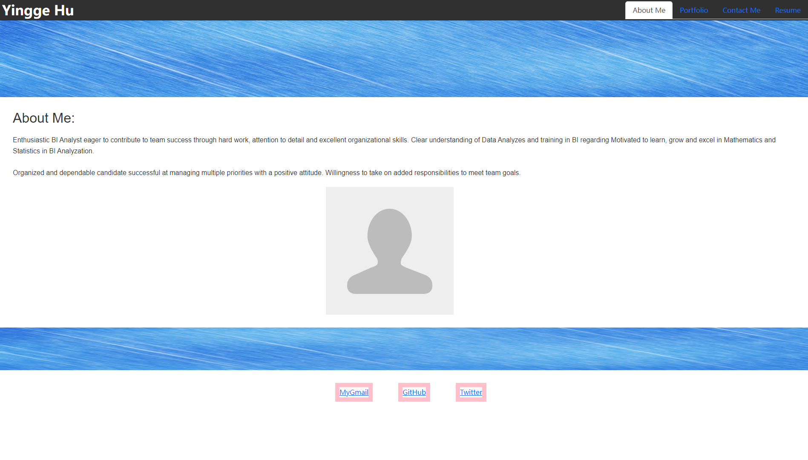

# MyReact-Portfolio

## Description

This is my personal Portfolio that created by React.js. It contains my brief introduction, my applications, my contact information, and my resume.

## Table of Contents

- [Installation](#installation)
- [Usage](#usage)
- [License](#license)
- [Contributing](#contributing)
- [Tests](#tests)
- [Questions](#questions)

## Installation

npm i

## Usage

npm start

## License

This project is licensed under the [MIT](https://opensource.org/licenses/MIT) license.

## Contributing

Contribution guideline

## Tests

test

## Questions

For any questions or concerns, please contact me at yingeberry@Qmail.com. You can also visit my [GitHub profile](https://github.com/huyingg1).

